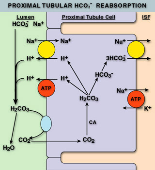

# Physiology

Acid-base regulation is essential for maintenance of physiologic functions, and is primarily controlled through respiratory and renal means. The underlying chemical buffering of the blood is primarily maintained by HCO3- ions, which can become carbonic acid when combined with a proton. The Henderson-Hasselbach equation for this equilibrium is $$ pH = 6.1 + \log{\frac{[HCO_3^-]}{[H_2CO_3]}} $$. This is equivalent to $$ pH = 6.1 + \log{\frac{[HCO_3^-]}{0.03*pCO_2 }} $$. pCO2 is controlled by respiration, while [HCO3-] is regulated by the kidneys. 

## Buffers

Extracellular bicarbonate and proteins along with intracellular phosphate and proteins are responsible for the majority of buffering within the body. The buffering system is rapid, but the magnitude of response is limited due to the finite supply of buffer in the body, although the supply of bicarbonate is relatively unlimited.

## Renal Regulation

The kidneys help to maintain proper acid-base balance by regulating the amount of bicarbonate and hydrogen ions in the blood. Most bicarbonate is reabsorbed in the PCT utilizing carbonic anhydrase (CA). Carbonic anhydrase confers bicarbonate in the urine into CO2, which diffuses into the cells of the PCT. CA in the PCT then converts the CO2 back into bicarb intracellularly. The bicarb follows sodium back into the blood stream. During this process, hydrogen ions are circulated with the bicarbonate: they are combined with bicarbonate in the lumen when CO2 is formed, then they are released intracellularly when bicarb is reformed. The hydrogen ions then diffuse out into the lumen through ion channels to be re-used. This results in no net change in hydrogen ions in the body or urine.

The kidneys are also capable of generating bicarbonate in two ways: Ammonium Excretion and "Titratable Acidity". Ammonium excretion utilizes a similar process to bicarbonate reabsorption, except ammonia is allowed to diffuse into the urine. Upon entry into the acidic urine, ammonia is protonated and trapped in the urine. This sequesters hydrogen ions from the bicarbonate production process that occurs intracellularly, and leads to a net production of bicarbonate. This process can produce approximately 40-300 mEq of bicarbonate daily.

The final mechanism of renal acid-base regulation is titratable acidity. This process involves utilizing filtered phosphate in the urine to sequester hydrogen ions as well, leading to increased amounts of bicarbonate production. This process can produce approximately 30 mEq of bicarbonate daily.

Beyond the production of bicarbonate, the DCT and collecting duct are capable of secreting hydrogen ions.

Hepatic metabolism of amino acids also contributes to this process, as it is the primary source of ammonium. This ammonium is usually controlled via urea production ($$2\; {HCO_3}^- + 2\; NH_4^+ \rightarrow Urea + CO_2 + 3\; H_2O$$), and therefore changes in the urea cycle can lead to acid base disturbances (decreases in urea production leads to metabolic alkalosis via preserved bicarbonate and increased ammoniagenesis).

## Respiratory Regulation

Respiratory regulation is primarily used in acute states to compensate for insults as well as to compensate for impaired renal function. Hyperventilation decreases pCO2 leading to respiratory alkalosis, and the hypoventilation produces the opposite effect.

## Acid Production

The body produces approximately 1 mEq/kg/d of H+ due to the oxidation of proteins and fats. Approximately 0.8 mEq/kg of H+ myst be excreted from the body from non-volatile acids produced during anaerobic metabolism as well as during the breakdown of cysteine, methionine, and phospholipids.

## Normal ABG Values

pH / paCO2  / paO2  / [HCO3]- / O2  Sat

| Lab                         | Low  | High | Units        |
| --------------------------- | ---- | ---- | ------------ |
| pH                          | 7.35 | 7.45 | n/a          |
| paCO2            | 35   | 45   | mmHg         |
| paO2             | 80   | 100  | mmHg         |
| HCO3- | 22   | 26   | mEq/L        |
| O2  Sat          | 95%  | 100% | % Saturation |

# Pathophysiology and Diagnosis

## Compensation Chart

Compensation should occur in simples (i.e. single) acid-base disorders, and the change in bicarbonate should be in the same direction as the change in CO2 (ex. increase bicarbonate will be compensated by increased CO2 in simple disorders).

| Condition                    | Compensation                          |
| ---------------------------- | ------------------------------------- |
| Metabolic Acidosis           | $$pCO_2 = 1.5* HCO_3 +8 \pm2$$        |
| Metabolic Alkalosis          | $$\Delta pCO_2 = 0.7 * \Delta HCO_3$$ |
| Acute Respiratory Acidocis   | $$\Delta HCO_3 = 0.1 * pCO_2 \pm 3$$  |
| Chronic Respiratory Acidocis | $$\Delta HCO_3 = 0.4 * pCO_2 \pm 4$$  |
| Acute Respiratory Acidosis   | $$\Delta HCO_3 = 0.1 * pCO_2$$        |
| Acute Respiratory Alkalosis  | $$\Delta HCO_3 = 0.3 * pCO_2$$        |

## Metabolic Acidosis

Metabolic acidoses are characterized by decreased levels of bicarbonate in the blood. Metabolic acidoses are split into two categories: anion gap and non-anion gap acidoses. In acidotic pts with a low bicarbonate, an anion gap and delta gap should be calculated.

$$
\text{Anion Gap} = [Na^+] - [Cl^-] - [{HCO_3}^-]\\
\text{Delta Gap} = \text{Pts' Anion Gap} - \text{Normal Anion Gap}
$$

A normal anion gap is 3-11 mEq/L, if the anion gap is elevated, the patient has an anion gap acidosis. If the patient has an anion gap calculate the delta gap. If the bicarb plus the delta gap is an elevated bicarb (&gt; 26 mEq/L), the patient is suffering from a mixed metabolic acidosis/alkalosis. Anion gap pts should also have a lactate drawn. If the $$\text{Anion Gap}-\text{Serum Lactate}$$ is a normal anion gap, the patient is likely suffering from lactic acidosis.

### Anion Gap Acidosis

**GOLD MARK**

* Glycols (Ethylene and propylene)
* 5-Oxoproline [(pyroglutamic acid)](http://joel.topf.googlepages.com/ClinJAmSocNephrol2006FenvesIncreased.pdf)
  * APAP ingestion in combination with severe sepsis
  * Renal Fx
  * Hepatic Fx
* L-Lactate
* D-Lactate
* Methanol
* ASA
* Renal Failure
* Ketosis (Diabetic, Alcoholic, etc)

**MUD PILES**

* Methanol
* Uremia
* Diabetic Ketoacidosis
* Propylene Glycol
* Intoxication
* Lactic Acidosis
* Ethylene Glycol
* Salycilates / Sepsis

#### Lactic Acidosis

Normal: 0.5-1 mmol/L

Moderately Elevated: 2-4 mmol/L

Severely Elevated: &gt; 4 mmol/L

Severely elevated pts should be worked up for severe bacterial infections, started on prophylactic Abx, and [Early Goal Directed Therapy](https://emcrit.org/pulmcrit/accelerated-goal-directed-therapy-for-septic-shock/) should be initiated until infection can be definitively r/o

**Causes**

* Infection
* Shock
* Ethanol
* Metformin
* Nucleoside Reverse Transcriptase Inhibitors
* Linezolid
* Isoniazid
* Propofol
* Propylene Glycol
* Szs
* Leukemia
* Hepatic / Renal Fx
* DM
* Malnutrition (Esp. Thiamine deficiency)
* Rhabdomyolysis

See the [EM-Crit Acid-Base Evaluation Sheet](https://emcrit.org/wp-content/uploads/acid_base_sheet_2-2011.pdf) for a full list of lactic acidosis causes under "Step V"

Lactic acidosis often presents with Kussmal respirations, flushing and peripheral vasodilation, lethargy, hyperkalemia, and N/V.

### Non-Anion Gap Acidosis (Hyperchloremic Acidosis)

#### Common Causes

* Diarrhea (Bicarb Losses)
* Fistula (Bicarb Losses)
* Type I, II, and IV Renal Tubular Acidosis
* Acid Administration (primarily acidic TPNs)
* Any fluid with a SID ($$[Na^+] - [Cl^-]$$) of &lt; 24 (NS, 1/2 NS, D5W)
* Renal Failure

#### Type I RTA

Defects in the collecting duct  lead to the inability to secrete hydrogen and reabsorb K. This acidosis and hypokalemia. K is further lost as Na is reabsorbed in the collecting duct, as a counter-ion must be exchanged, and it cannot be hydrogen.

**Causes**

* SLE
* Myeloma
* Sickle Cell
* Li+
* Amphotericin B
* Toluene Toxicity
* Cirrhosis

#### Type II RTA

Bicarbonate cannot be reabsorbed in the PCT leading to bicarb wasting sodium loss (to balance the charge of the lost bicarb). This leads to increased fluid loss resulting in secondary hyperaldosteronism and hypokalemia.

**Causes**

* Heavy Metal toxicity
* Wilson's Disease
* CA Inhibitors
* Topiramate
* Vit D Deficiency

#### Type IV RTA

Lack of aldosterone prevents the secretion of hydrogen in the collecting duct. This prevents ammoniagenesis, and also creates a potassium-sparing effect causing hyperkalemia. 

**Causes**

* Hypoaldosteronism
* Diabetic Nephrophathy leading to hyporeninism
* NSAIDs
* Potassium Sparing Diuretics and Aldosterone Antagonists
* ACEIs / ARBs

#### Differentiating RTAs from Other Non-Anion Gap Acidoses

Order a urine chemistry and calculate the urine anion gap (same formula as serum, but using urine electrolytes). A positive urine anion gap suggests the presence of an RTA.

| RTA  | Urine pH  | Serum Potassium |
| ---- | --------- | --------------- |
| I    | &gt; 5.55 |                 |
| II   | &lt; 5.55 | Normal or Low   |
| IV   | &lt; 5.55 | High            |

### Treatment

* Remove underlying cause
* Consider Bicarb if pH &lt; 7.1
  * Esp. useful if hyperkalemia, revived cardiac arrest, and overdoses
  * Cardiac arrest pts receive ~1 mEq/kg
  * Give 1/3-1/2 of dose as calculated below, and use 12 as target bicarb to prevent alkalosis
  * Dose: $$[0.5 L/kg * \text{IBW} * (\text{Desired }HCO_3 - \text{Actual }HCO_3)]$$
  * Monitor K, Ca, Na, and Serum Osm; alkalosis decreases oxygen release from heme which can lead to neural hypoxia; CSF acidosis can occur as excess CO2 diffuses into the CSF
  * Chronic bicarb can be used for RTAs at 1-3 mEq/kg QD (may increase to &gt;10)

## Metabolic Alkalosis

### SSx

* Muscle Cramps (if Hypokalemic)
* Weakness
* Paresthesias
* Postural Dizziness
* Coma / Mental Confusion
* Szs
* Myocardial suppression and arrythmias

### Saline Responsive Alkalosis (Urine [Cl] &lt; 10-20 mEq/L)

#### Causes

* Diuretics => Hypovolemia
  * Causes aldosterone release which increases hydrogen secretion causing alkalosis
* Hypokalemia
  * Hypokalemia leads to K moving out of cells and H and Na moving in as counter-ions
* Hypochloremia
  * Bicarb is reabsorbed as the countering to Na
* Vomiting & NG Suction
* Bicarb Administration

#### Treatment

* Repeat w/ NS & K20-40 over 6 hours then NS & K20-40 @ 125-200 mL/hr
* Monitor I/Os, HR, BP, SSx of Peripheral / Pulmonary Edema, and Electrolytes
* Consider CA Inhibotrs
  * Acetohexamide 250-375mg PO QD or BID
  * Can cause increased K wasting
  * Useful in pts that cannot tolerate extra fluid
  * Not useful in volume depletion, renal dysfunction, or pH &gt; 7.55
* Consider HCl infusion if not responding needed

### Saline Resistant Alkalosis (Urine [Cl] &gt; 20 mEq/L) 

#### Causes

* Increased Mineralocorticoid Activity
  * Increased hydrogen secretion leading to increased ammoniagenesis
* Hypokalemia
  * Increased proton secretion in the collecting duct (countering for Na instead of K)
* Renal Tubular Chloride Wasting
  * Inability to reabsorb NaCl leads to increased aldosterone (aka increased MC activity)

#### Treatment

* Spironolactone or KCl supplementation
* Give fluids to correct hyperaldosteronism

## Respiratory Acidosis

### Causes

* Asthma
* Foreign Body Airway Obstruction
* Aspiration
* Decreased Respiratory Drive
  * CNS Infection
  * Trauma
  * Sleep Apnea
  * Drug Overdose
* Cardiac Arrest
* PE
* ALS / Guillain-Barre
* Incorrect Mechanical Ventilation

### SSx

* Dyspnea / SOB
* HA
* Drowsiness
* Confusion
* Coma
* Szs
* Tachycardia
* Arrythmias
* Hypotension

### Treatment

* Correct the underlying cause
* Mechanical ventilation
* Avoid rapid correction
* May need bicarbonate if severe acidosis

## Respiratory Alkalosis

### Causes

* Decreased Respiratory Stimulation
  * Anxiety
  * Pain / Injury / Trauma
  * Hypoxemia
  * Hypotension
  * High Altitude
  * CHF
* Incorrect Mechanical Ventilation
* PE
* Pulmonary Edema
* Pneumonia
* Salicylate Intoxication

### Treatment

* Correction of underlying cause
* Sedation
* Paralysis
* Ventilation

# Henderson-Hasselbach Acid-Base Evaluation

Determine if bicarb, CO2, or both change in the same direction as pH
* If both do, then calculate compensation
* If only one changes in the same direction as pH, there is a mixed disorder where both are acidotic or alkalotic.
* If change is in opposite direction with relatively normal pH, consider a mixed (opposing) or triple disorder

# Quantitative Acid-Base Evaluation

$$
\text{Strong Ion Difference} = Na + K + \text{Ionized }Mg + \text{Ionized }Ca - Cl\\
\text{Strong Ion Difference} \approx Na - Cl\\
\text{Base Deficit} \approx 24.2 - HCO_3\\
\text{Strong Ion Gap} \approx BD + (SID - \text{Normal SID}) + 2.5 [4.2-\text{Albumin}] - \text{Lactate}\\
\text{Osm Gap} = \text{Measured Osm} - (2*Na + Gluc / 18 + BUN / 2.8 + EtOH / 3.7)\\
\text{Base Deficit} = -\text{Base Excess}
$$

Notes on calculations: The approximate SID is appropriate unless the pt is suffering from hyperkalemia. Normal SID for the approximation is 38, while the Normal Exact SID is 42. Base deficits should be given by the ABG, but this approximation can be used if the ABG does not provide a BD

1. Order ABG, Lactate, Albumin, Acetone, and Blood Chemistry
2. Is the pt acidotic?
3. Is pCO2 &gt; 45 or &lt; 35
   * &gt; 45 implies respiratory acidosis
   * &lt; 35 implies respiratory alkalosis
4. Is SID &gt; or &lt; Normal
   * &lt; Normal implies SID metabolic acidosis (non-anion gap)
   * &gt; Normal implies metabolic alkalosis
5. Is the lactate elevated?
   * Consider causes of lactic acidosis, and consider Step 6 to determine if the patient's problem is exclusively due to lactic acidosis
6. SIG &gt; 2 or Negative?
   * &gt; 2 implies Anion-Gap Acidosis
   * Negative implies hypercalcemia, hypermagnesemia, hyperkalemia (if not using accurate SID calculation), bromides, nitrates, or Lithium overdose
7. Compensation
   * Respiratory Problem: $$\Delta BE = 0.4*\text{Chronic CO2 Change}$$
   * Metabolic Acidosis: $$\downarrow CO_2 = BD$$
   * Metabolic Alkalosis: $$ \uparrow CO_2 = 0.6 * BE$$
   * COPD Pts: $$ -0.08\; \Delta pH = 10\; \Delta paCO_2 $$
8. Osmolar Gap for Elevated SIG w/o Explanation
   * Osm Gap &gt; 10: Methanol, Ethalene Glycol, Isopropanol, Lithium
   * Osm Gap &gt; 50: Almost certainly toxic alcohol

See the [EM-Crit Acid-Base Evaluation Sheet](https://emcrit.org/wp-content/uploads/acid_base_sheet_2-2011.pdf) for more details on Quantitative Acid Base

# NS, 1/2NS, and D5W Acidotic Mechanism

The acidosis associated with infusions of non-balanced crystalloid fluids has nothing to do with the presence of Cl-, the weak base of HCl. It instead has to do with the dilution of the bodies natural buffer, bicarbonate. Dilution of endogenous bicarb with significant volumes of crystalloid leads to a shift in the equilibrium point of the Henderson-Hasselback equation. Holding pCO2 constant (pCO2 is held constant because the lungs will rapidly return pCO2 to the appropriate physiologic value) shows that decreasing the bicarbonate concentration leads to a decrease in pH.

$$
pH = 6.1 + \log{\frac{{HCO_3}^-}{0.03*pCO_2}}
$$

This result is supported by the Quantitative Acid-Base approach to fluid acidity. NS, 1/2NS, and D5W all have SID=0, implying they are highly acidic fluids due to the dilutional effects on albumin and bicarb. However, fluids such as LR, which have a SID of 24-28 (due to the contents of 24-28 mEq/L of lactate, which is converted to bicarbonate), will not dilute the buffering bicarbonate or concentrate it (as would be the case in infusions of more concentrated bicarbonate solutions). Therefore, solutions with an SID lower than the patient's current bicarbonate will induce acidosis, while solutions with an SID higher than the patient's  current bicarbonate will induce alkalosis.