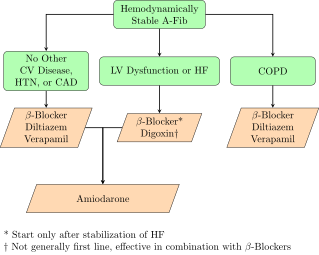
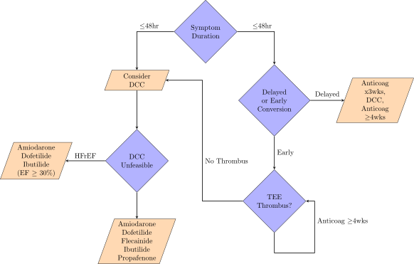
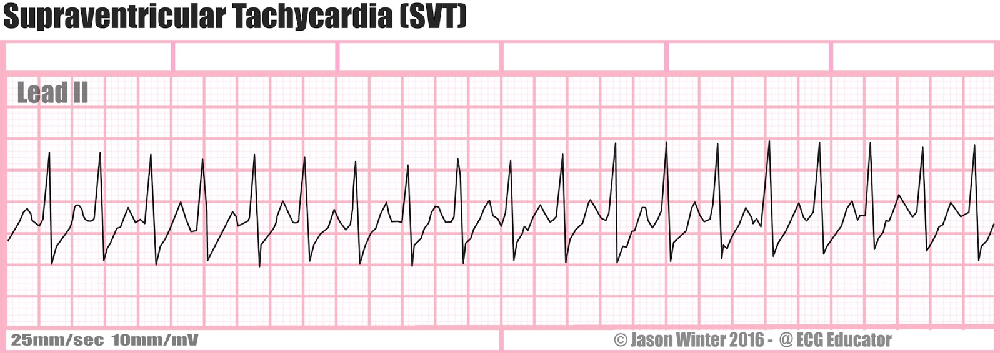
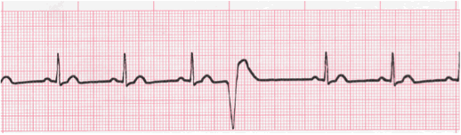
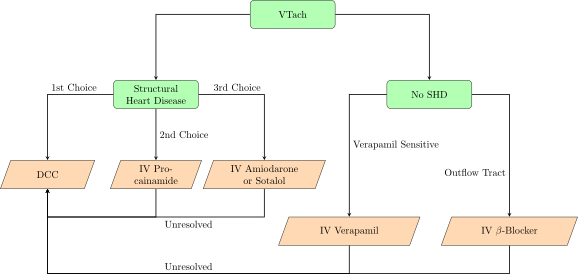
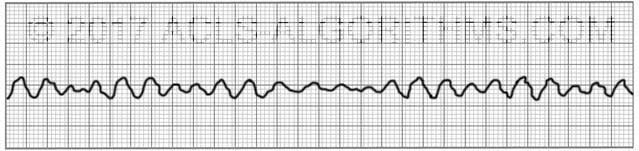

# Cardiac Conduction Physiology

Pacemaker cells are primarily governed by Ca channels, while myocytes are governed by Na channels. Activation of &beta; receptors leads to increased levels of cAMP which directly stimulates HCN channels to open, and through activation of PKA stimulates the activation of Ca channels. Cholinergic activation opposes this by activation of Gi.

## Vaughan-Williams-Singh Antiarrhythmic Scale

* Class 1: Na Channel Blockers
  * 1a: Mixed Na and K Blockade (moderate dissociation), blocks open state of Na, widens QRS and prolongs QT
  * 1b: Fast dissociation, slightly shortens phase 2, minimal clinical impact
  * 1c: Strong (slow dissociation) Na blockade slowing 0, widens QRS
* Class 2: &beta;-blockers
* Class 3: K Blockers
* Class 4: non-DHP CCBs

# EKG Normal Values

| Measure       | Interval (ms) |
| ------------- | ------------- |
| PR Interval   | 120-200       |
| QRS           | 80-120        |
| QT*           | 380-460       |
| QTc (Male)*   | 360-470       |
| QTc (Female)* | 360-480       |

*High risk of Torsades w/ QTc &ge; 500ms

$$QTc=\frac{QT}{\sqrt{60/HR}}$$

# Sinus Bradycardia (Sick Sinus Syndrome)

A sinus, regular rhythm with a HR &lt; 60 BPM

## Risk Factors

* Myocardial infarction or ischemia
* Abnormal sympathetic or parasympathetic tone
* Electrolyte abnormalities
  * Hyperkalemia
  * Hypermagnesemia
* Drugs
  * Digoxin
  * ß-blockers
  * CCBs (Diltiazem, verapamil)
  * Amiodarone
  * Dronedarone
  * Ivabradine
* Idiopathic

## SSx

* Hypotension
* Dizziness
* Syncope

## Treatment

**Only treat symptomatic patients**

* Atropine 0.5mg q5min to max of 3mg or 0.04 mg/kg
  * Tachycardia
  * Urinary retention
  * Blurred vision
  * Dry mouth
  * Mydriasis
* Refractory to Atropine
  * Transcutaneous pacing
  * Dopamine 2-10 mcg/kg/min
  * Epi 2-10 mcg/min
* Long term treatment may require permanent pacemaker

# Atrial Fibrillation

Characterized by an irregularly irregular rhythm with a ventricular rate of 120-180 BPM. P waves are often absent. A-fib is usually caused by abnormal atria or pulmonary vein automaticity sustained by atrial reentry circuits.

## Classifications of A-fib

* Paroxysmal
  * Intermittent episodes
  * Episodes start suddenly and spontaneously, last for minutes to hours, and terminate suddenly and spontaneously
* Persistent
  * A continuous episode of AF that does not terminate spontaneously
  * May last > 7 days
* Long-standing persistent
  * Continuous AF > 12 months in duration
* Permanent
  * Pt never returns to sinus rhythm and cannot be converted
  * Usually a joint decision to stop escalating therapy
* Nonvalvular
  * Not accompanied by any valvular disease

## Risk Factors

* HTN
* CAD
* CHF
* Old age
* DM
* Obesity
* OSA
* Valvular heart disease
* Rheumatic heart disease
* Smoking
* Genetic
* IdiopathicHyperthyroidism
* PE
* Thoracic Surgery
  * Coronary artery bypass graft (CABG)
  * Lung resection
  * Esophagectomy
* Excessive EtOH use

## SSx

* Asymptomatic A-fib is somewhat common
* Palpitations
* Dizziness
* Fatigue
* Lightheadedness
* SOB
* Hypotension
* Syncope
* Angina (if pt has CAD)
* CHF exacerbation

## Treatment Goals

| Persistent A-Fib                  | Paroxysmal A-Fib                  | Permanent A-Fib                   |
| --------------------------------- | --------------------------------- | --------------------------------- |
| Ventricular Rate Control          | Ventricular Rate Control          | Ventricular Rate Control          |
| Prevention of Stroke and Emoblism | Prevention of Stroke and Emoblism | Prevention of Stroke and Embolism |
| Convert to Sinus Rhythm           | Maintain Sinus Rhythm             |                                   |

## Treatment

### Ventricular Rate Control

Treat to goal HR of &lt; 110 BPM unless the patient is symptomatic or has HFrEF, then treat to goal of 80 BPM

| Drug        | Loading Dose                                                 | Daily Dose                                               | SEs                                                          | Notes                                            |
| ----------- | ------------------------------------------------------------ | -------------------------------------------------------- | ------------------------------------------------------------ | ------------------------------------------------ |
| Diltiazem   | 0.25 mg/kg IV over 2 min                                     | 5-15 mg/hr or 120-360 mg ER PO QD                        | Hypotension Bradycardia HFrEF Exacerbation AV Blockade |                                                  |
| Verapamil   | 0.075-0.15 mg/kg IV over 2 min w/ an addition 10 mg at 30 min if needed | 0.005 mg/kg/min or 120-380 mg ER PO QD                   | Hypotension Bradycardia HFrEF Exacerbation AV Blockade Constipation | Increases levels of Digoxin and Dofetilide       |
| Esmolol     | 500 mcg/kg IV over 1 min                                     | 50-300 mcg/kg/min IV                                     | &beta;-Blockade                                              |                                                  |
| Propranolol | 1mg IV over 1min q2min Max of 3 doses                        | 30-60mg PO Daily in divided doses                        | &beta;-Blockade                                              |                                                  |
| Metoprolol  | 2.5-5mg IV over 2 min Max of 3 doses                         | Tartrate: 25-100mg PO BID Succinate: 50-400mg PO QD | &beta;-Blockade                                              |                                                  |
| Digoxin     | 0.25mg IV q4hr Max of 1.5mg over 24hr                        | 0.125-0.375mg PO or IV QD                                | N/V Anorexia Arrythmias                            | Amiodarone and Verapamil Increase Digoxin Levels |
| Amiodarone  | 300mg IV over 1hr                                            | 10-50 mg/hr over 24hr 100-200mg PO QD               | Hypotension Bradycadia Photosensitivity Pulmonary Fibrosis Blue-Grey Skin Hepatotoxicity Hypo- / Hyperthyroidism | Increases levels of warfarin and digoxin         |

### Sinus Rhythm Conversion

| Drug        | Loading Dose                                                 | Maintenance dose                                             | SEs                                      | Notes                                                        |
| ----------- | ------------------------------------------------------------ | ------------------------------------------------------------ | ---------------------------------------- | ------------------------------------------------------------ |
| DCC         | 120-200 J Biphasic 200 J Monophasic                     | n/a                                                          | Pain Risks of General Sedation      |                                                              |
| Amiodarone  | 150mg over 10 min 600-800mg QD in 2-3 divided doses for total loading dose of 10g | 1 mg/min for 6hrs then 0.5 mg/min for 18 hr 200mg PO QD | Hypotension Bradycardia             | Increases levels of Digoxin and Warfarin 24hr conversion |
| Dofetilide  | See Table Below                                              | n/a                                                          | TdP                                      | Cimetidine HCTZ Ketoconazole Trimethoprim Verapamil (All raise levels of dofetilide) 24hr conversion |
| Ilbutilide  | 1mg IV over 10 min q10min x2 if needed &lt; 60kg use 0.01 mg/kg | n/a                                                          | TdP                                      | 30min conversion                                             |
| Propafenone | 450-600mh PO x1                                              | n/a                                                          | Dizziness Blurred Vision HFrEF | 3-8hr conversion CI in HF                               |
| Flecainide  | 200-300mg PO x1                                              | n/a                                                          | Dizziness Blurred Vision HFrEF | 3-8hr conversion CI in HF                               |

| CrCl    | Dofetilide A-Fib Dose |
| ------- | --------------------- |
| &gt; 60 | 500 mcg PO BID        |
| 40-60   | 250 mcg PO BID        |
| 20-40   | 125 mcg PO BID        |
| &lt; 20 | CI                    |

### Sinus Rhythm Maintenance

### Anticoagulation

Anticoagulation is required for all A-Fib patients. Appropriate anticoagulants include warfarin, dabigatran, rivaroxaban, apixaban, and edoxaban. See [Anticoagulants]({{ site.baseurl }}/drugClasses/anticoagulants.html) for appropriate dosing, monitoring, and therapy selection for these patients.

# Paroxysmal Supraventricular Tachycardia

PSVT presents as a narrow complex, regular tachycardia which spontaneously initiates and terminates.

PSVT is most commonly due to re-entrant circuits within the:

* AV Node (60%)
* Accessory Pathways (WPW, 30%)
* Atria (4-8%)
* SA Node (4%)

PSVT is more common in women and those over the age of 65, and usually occurs in pts w/o a significant CV Hx.

## SSx

* Neck-pounding
* Palpitations
* Dizziness
* Weakness
* Lightheadedness
* Near-syncope / Syncope
* Polyuria

## Treatment

### Cardioversion of Hemodynamically Stable Patients

1. Vagal Maneuvers and/or IV Adenosine
2. IV Rate Control Drugs (&beta;-Blockers or nonDHP-CCBs)
3. Synchronized DCC

| Drug      | Dose                                               | SEs                                                          | Notes                                                        |
| --------- | -------------------------------------------------- | ------------------------------------------------------------ | ------------------------------------------------------------ |
| Adenosine | 6mg IVPB w/ flush 12mg in 1-2min x2 if needed | Chest Pain Flushing SOB Sinus Pause Bronchospasm | Carbamazepine and dipyridamole alter adenosine response, decrease dose by 50% |
| Diltiazem   | 0.25 mg/kg IV over 2 min                                     | 5-15 mg/hr or 120-360 mg ER PO QD                        | Hypotension Bradycardia HFrEF Exacerbation AV Blockade |
| Verapamil   | 0.075-0.15 mg/kg IV over 2 min w/ an addition 10 mg at 30 min if needed | 0.005 mg/kg/min or 120-380 mg ER PO QD                   | Hypotension Bradycardia HFrEF Exacerbation AV Blockade Constipation |
| Esmolol     | 500 mcg/kg IV over 1 min                                     | 50-300 mcg/kg/min IV                                     | &beta;-Blockade                                              |
| Propranolol | 1mg IV over 1min q2min Max of 3 doses                        | 30-60mg PO Daily in divided doses                        | &beta;-Blockade                                              |
| Metoprolol  | 2.5-5mg IV over 2 min Max of 3 doses                         | Tartrate: 25-100mg PO BID Succinate: 50-400mg PO QD | &beta;-Blockade                                              |
| Amiodarone  | 150mg IV over 10 min                              | 1 mg/min for 6hr then 0.5 mg/min for 18hr | Hypotension Bradycadia Photosensitivity Pulmonary Fibrosis Blue-Grey Skin Hepatotoxicity Hypo- / Hyperthyroidism |

### Prevention of Symptomatic PSVT

**Drug therapy should only be initiated in SYMPTOMATIC patients**

# Premature Ventricular Complexes

PVCs present as irregular, wide QRS complexes that do not follow a P-wave. Prevalence of these arrhythmias increases with age, and they are indicative of increased cardiovascular risk in patients &gt; 30yo. &gt; 10k-20k PVCs QD is indicative of cardiomyopathy. PVCs occur due to increased automaticity of myocytes and/or purkinje fibers.

## Risk Factors

* IHD
* MI
* Anemia
* Hypoxia
* Cardiac Surgery

## SSx

* Usually Asymptomatic
* Palpitations
* Dizziness
* Lightheadedness

## Treatment

**Asymptomatic patients should NOT be treated**

* Non CV Pts
  1. &beta;-Blockers, Diltiazem, or Verapamil
  2. If unresponsive, antiarrhythmics
  3. Ablation
* CAD Pts
  1. &beta;-Blockers, Diltiazem, or Verapamil
  2. If unresponsive, antiarrhythmics (Avoid Class 1C)
* HFrEF Pts
  1. &beta;-Blockers

# Ventricular Tachycardia

VTach presents as a regular, wide complex tachycardia defined as at least 3 consecutive PVCs at a rate of &gt; 100 BPM. Sustained VTach is defined as either VTach lasting longer than 30s, or VTach requiring intervention w/i 30s due to hemodynamic instability. Otherwise, it is classified as non sustained. VTach in patients w/o SHD is referred to as idiopathic, and will either be verapamil sensitive or outflow tract VTach (&beta;-blocker sensitive). VTach occurs as a result of increased myocyte automaticity which is sustained by reentry circuits.

## Risk Factors

* Coronary artery disease
* Myocardial infarction
* HFrEF
* Hypokalemia
* Hypomagnesemia
* Drugs
  * Flecainide
  * Propafenone
  * Digoxin

## SSx

* May be asymptomatic (nonsustained VT)
* Palpitations
* Hypotension
* Dizziness
* Lightheadedness
* Syncope
* Angina

## Treatment

### Termination of Hemodynamically Stable VTach

| Drug         | Loading Dose                       | Maintenance Dose                          | SEs                                                        | Notes                                                        |
| ------------ | ---------------------------------- | ----------------------------------------- | ---------------------------------------------------------- | ------------------------------------------------------------ |
| Procainamide | 10-17 mg/kg IV at 20-50 mg/min     | 1-4 mg/min                                | Hypotension QT Prolongation TdP                  | Cimetidine, Ranitidine, and Trimethoprim inhibit procainamide elimination |
| Amiodarone   | 150mg IV over 10 min               | 1 mg/min for 6hr then 0.5 mg/min for 18hr | Hypotension Bradycardia Phlebitis                | Increases levels of Digoxin and Warfarin                     |
| Sotalol      | 75mg IV Q12H                       | n/a                                       | Hypotension Bradycardia QT Prolongation TdP |                                                              |
| Verapamil    | 2.5-5mg IV Q15-30min at 1-3 mg/min | n/a                                       | Hypotension Bradycardia HFrEF exacerbation       | Inhibits the elimination of digoxin and dofetilide           |
| Esmolol     | 500 mcg/kg IV over 1 min                                     | 50-300 mcg/kg/min IV                                     | &beta;-Blockade                                              |
| Propranolol | 1mg IV over 1min q2min Max of 3 doses                        | 30-60mg PO Daily in divided doses                        | &beta;-Blockade                                              |
| Metoprolol  | 2.5-5mg IV over 2 min Max of 3 doses                         | Tartrate: 25-100mg PO BID Succinate: 50-400mg PO QD | &beta;-Blockade                                              |

### Prevention of VTach

* ICD
  * Preferred Therapy
* Amiodarone 400mg PO QD
  * Useful in pts w/ frequent ICD shocks
* Sotalol 80-160mg PO QD
  * Useful in pts w/ frequent ICD shocks
* Catheter Ablation
  * Recommended for pts w/ prior MI or who are intolerant to antiarrythmics

# Ventricular Fibrillation

VFib presents as irregular, chaotic electrical activity with no palpable pulse and no QRS complexes

## Risk Factors

* MI
* HFrEF
* CAD

## Treatment

1. CPR x2min and obtain vascular access
2. Defibrillation (120-200 J Biphasic or 360 J Monophasic)
3. CPR x2min
4. Epi 1mg
5. Defibrillation (120-200 J Biphasic or 360 J Monophasic)
6. CPR x2min
7. Amiodarone 300mg in 20-30mL D5W
8. Defibrillation (120-200 J Biphasic or 360 J Monophasic)
9. CPR x2min
10. Epi 1mg
11. Defibrillation (120-200 J Biphasic or 360 J Monophasic)
12. CPR x2min
13. Amiodarone 150mg in 20-30mL D5W
14. Defibrillation (120-200 J Biphasic or 360 J Monophasic)
15. CPR x2min
16. Epi 1mg
17. Defibrillation (120-200 J Biphasic or 360 J Monophasic)
18. Repeat steps 15-17 until the end of code
