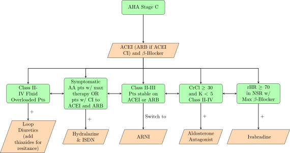

# HF Pathophysiology

## Frank-Starling and Force-Tension Curves

 

The Frank-Starling mechanism is shown above. Changing preload leads to shifting along the curve, and increasing inotropy or decreasing afterload leads to shifting the curve upward. An opposite relationship is observed with SV vs Afterload, the curve is downsloping and shifts up with both positive inotropy and increased preload. 

## Drug-Induced HF

* Drugs Which Decrease CO
  * Antiarrhythmics
  * &beta;-blockers
  * CCBs
  * Itraconazole
* Cardiotoxic Drugs
  * Doxorubicin
  * Epirubicin
  * Daunomycin
  * Trastuzumab
  * Bevacizumab
  * 5-FU
  * Blue cohosh
  * Imatinib
  * Lapatinib
  * Sunitinib
  * Ethanol
  * Cocaine
  * Amphetamines
* Drugs Increasing Fluid Retention / Afterload
  * GC / MC / Androgens / Estrogens
  * NSAIDs
  * Rosiglitazone / Pioglitazone
  * Sodium Containing Drugs

## SSx

| Non-Specific       | RV Failure   | LV Failure                   |
| ------------------ | ------------ | ---------------------------- |
| Fatigue / Weakness | Edema        | DOE                          |
| Nocturia           | JVD          | Orthopnea                    |
| Cardiomegaly       | HJR          | Paroxysmal Nocturnal Dyspnea |
|                    | Hepatomegaly | Rales                        |
|                    | Ascites      | Pulmonary Edema              |

BNP &gt; 100 pg/mL or NT-proBNP &gt; 300 pg/mL are indicative of fluid overload due to cardiac problems

## Classification / Staging

### NYHA Functional Class

I. Pts w/ disease w/o physical limitations

II. Pts w/ minor physical limitations

III. Pts w/ significant physical limitations

IV. Pts w/ significant physical limitation and SSx at rest

### AHA Staging

A. Pts w/ high risk w/o CHF (i.e. pts w/ DM, HTN, CAD, etc)

B. SHD w/o symptoms

C. Symptomatic HF

D. Symptomatic HF refractory to maximized medical therapy

# HFrEF (LVEF &lt; 40%)

## Non-Pharmacologic Interventions

* Reduce Na intake to 2-3g QD (4-6g NaCl)
* Limit EtOH intake
* Influenza and Pneumococcal Vaccinations
* K and Mg Managment
* Thyroid Therapy PRN

## Medication Therapy

Stage A pts should be initiated on an ACEI

Stage B pts should be initiated on an ACEI and a &beta;-blocker

Digoxin can also be added in Stage C patients with otherwise maximal therapy to reduce HF hospitalizations, but digoxin offers no mortality benefit.

### ACEIs, ARBs, and ARNIs

Initiate 1 of the following, starting with ACEIs. If a cough exists, consider switching to ARBs. If stable on EITHER an ACEI or ARB an ARNI can be initiated 36hr after D/C of ACEI or ARB. Double the initial dose q2wks until at goal.

**If pts have eGFR &lt; 30 decrease initial and target doses by 50%. Entresto should also be decreased by half in pts w/ moderate hepatic impairment or &gt; 75yo.**

| Drug       | Initial dose       | Target Dose             |
| ---------- | ------------------ | ----------------------- |
| Enalapril  | 2.5-5mg PO BID     | 10mg PO BID             |
| Lisinopril | 2.5-5mg PO QD      | 20mg PO QD              |
| Captopril  | 6.25-12.5mg PO TID | 50mg TID                |
| Ramipril   | 1.25-2.5mg PO QD   | 5mg PO BID / 10mg PO QD |

| Drugs       | Initial Dose  | Target Dose  |
| ----------- | ------------- | ------------ |
| Losartan    | 25-50mg PO QD | 150mg PO QD  |
| Valsartan   | 20-40mg PO QD | 160mg PO BID |
| Candesartan | 4mg PO QD     | 32mg PO QD   |

| Tolerated ACEI/ARB Dose                                      | Initial Entresto Dose | Target Dose     |
| ------------------------------------------------------------ | --------------------- | --------------- |
| &ge;10mg Enalapril QD or Equiv &ge; 80mg Valsartan BID or Equiv | 49/51mg PO BID        | 97/103mg PO BID |
| All other pts                                                | 24/26mg PO BID        |                 |

**ACEI / ARB / ARNI Monitoring**

* BP
* Renal Function and K before initiation, 1-2wks after each change, and q3-6mo
* SEs

**ACEI / ARB / ARNI CIs**

* Pregnancy
* Hx of Angioedema
* Well-Documented Intolerance
* Bilateral Renal Artery Stenosis

### &beta;-Blockers

Double dose q2wks w/ intensive monitoring until at goal.

| Drug          | Initial Dose    | Target Dose                                |
| ------------- | --------------- | ------------------------------------------ |
| Bisoprolol    | 1.25mg PO QD    | 10mg PO QD                                 |
| Carvedilol IR | 3.125mg PO BID  | 25mg PO BID (50mg PO BID if &gt;85kg) |
| Carvedilol CR | 10mg PO QD      | 80mg PO QD                                 |
| Metoprolol XL | 12.5-25mg PO QD | 200mg PO QD                                |

**One of these four medications must be used, all other &beta;-blockers are unacceptable**

| Carvedilol  | Carvedilol CR |
| ----------- | ------------- |
| 3.125mg BID | 10mg QD       |
| 6.25mg BID  | 20mg QD       |
| 12.5mg BID  | 40mg QD       |
| 25mg BID    | 80mg QD       |

**Monitoring**

* BP
* HR
* SSx of Worsening HF

### Diuretics

| Drug            | Initial Dose         | Target Dose           | CrCl 20-50 Target  | CrCl &lt; 20 Target        |
| --------------- | -------------------- | --------------------- | ------------------ | -------------------------- |
| Furosemide      | 20-40mg PO QD or BID | 20-160mg PO QD or BID | 160mg PO QD or BID | 400mg PO Total Daily Dose  |
| Bumetanide      | 0.5-1mg PO QD or BID | 1-2mg PO QD or BID    | 2mg PO QD or BID   | 8-10mg PO Total Daily dose |
| Torsemide       | 10-20mg PO QD        | 10-80mg PO QD         | 40mg PO QD         | 200mg PO Total Daily Dose  |
| Ethacrynic Acid | 25-50mg PO QD or BID |                       |                    |                            |

Oral Loop Interconversion Doses: 40mg F = 1mg B = 10-20mg T = 50mg E

| Drug           | Initial Dose    | Target Dose |
| -------------- | --------------- | ----------- |
| HCTZ           | 25mg PO QD      | 50mg PO QD  |
| Metolazone     | 2.5mg PO QD     | 10mg PO QD  |
| Chlorthalidone | 12.5-25mg PO QD | 100mg PO QD |

**Monitoring**

* Electrolytes
* Kidney Function
* Fluid Status

### Aldosterone Receptor Antagonists

ARA should be initiated in pts w/ SCr &lt; 2.5 (men) or &lt; 2 (women), CrCl &gt; 30, and K &lt; 5. KCl supplementation is not indicated unless K &lt; 4 while on ARA.

| Drug           | CrCl    | Initial Dose        | Target Dose     |
| -------------- | ------- | ------------------- | --------------- |
| Spironolactone | &ge; 50 | 12.5-25mg PO QD     | 25mg PO QD      |
|                | 30-49   | 12.5mg PO QOD or QD | 12.5-25mg PO QD |
| Eplerenone     | &ge; 50 | 25mg PO QD          | 50mg PO QD      |
|                | 30-49   | 25mg PO QOD         | 25mg PO QD      |

**Monitoring**

* SCr & K 3-7d after dose / drug change or acute illness then q3mo

### ISDN and Hydralazine

| Drug        | Initial Dose  | Target Dose | Maximum Dose |
| ----------- | ------------- | ----------- | ------------ |
| Hydralazine | 25mg TID / QD | 75mg TID    | 100mg TID    |
| ISDN        | 20mg TID/QD   | 40mg TID    | 80mg TID     |

**SEs**

* HA
* N/V
* Dizziness
* Tachycardia
* Lupus Like Syndome
* Hypotension
* Myocardial Ischemia
* Fluid Retention

### Ivabradine

Indicated for reducing hospitalization for symptomatic HF with NSR with rHR &ge; 70 and EF &le; 35% with maximally titrated &beta;-blocker OR patients with a &beta;-blocker CI.

**Initial Dose: 2.5-5mg PO BID adjusted q2wks**

| rHR                           | Dose Adjustment                        |
| ----------------------------- | -------------------------------------- |
| &gt; 60                       | Increase 2.5mg BID to Max of 7.5mg BID |
| 50-60                         | Do Not Adjust                          |
| &lt; 50 OR SSx of Bradycardia | Decrease by 2.5mg BID including to D/C |

**SEs**

* Fetal Toxicity
* A-Fib
* Bradycardia
* Conduction Abnormalities

### Digoxin

Initiate at 0.125-0.25mg QD, do not load unless the pt has A-Fib, then follow A-Fib dosing. Target serum concentration 0.5-1 ng/mL. Pts &gt; 70yo, impaired renal function, or low weight may require lower doses.

**SEs**

* Anorexia
* N/V/Abdominal Pain
* Visual Disturbances (Halos, Photophobia, Altered Colors)
* Fatigue / Weakness
* Dizziness
* HA
* Confusion / Delirium / Psychosis
* Nerualgias
* PVCs / VTach / VFib
* AV Block
* AV Junctional Escape Rhythm
* Sinus Bradycardia
* Atrial Arrythmias

**Factors Leading to Digoxin Toxicity**

* Hypokalemia / Hypomagnesemia
* Hypercalcemia
* Old Age
* Alkalosis
* Hypoxia
* Renal Dysfunction
* Hypothyroidism
* Drug Interactions
  * Amiodarone
  * Verapamil

# HFpEF (LVEF &gt; 40%)

Maximize control of underlying disease, consider adding ARAs. Titrations are not necessary as they are in HFrEF.

# Acute Decompensated HF

**Complete This Section**