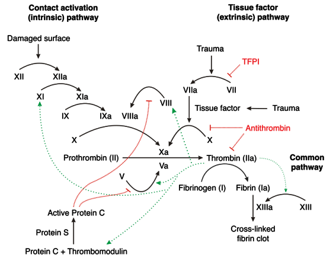

# Coagulation Cascade

Clotting Factors are produced exclusively in the liver, with the exception of vWF (endothelium, subendothelium, and megakaryocytes) and Factor VIII (liver and endothelium). The cascade begins when Tissue Factor (TF) binds to Factor VII after vascular wall injury exposes extra-vascular tissue. This process begins the extrinisic pathway. The intrinsic pathway is initiated by thrombin (Factor IIa) cleaving Factor XII in response to exposed collagen from damaged endothelial cells. The coagulation cascade is naturally inhibited by Antithrombin III (AT, neutralizes Thrombin, Xa, and IXa), Protein C (neutralizes Va and VIIIa), and Xa (activates Tissue Factor Pathway Inhibitor).

# Lab Tests

| Test           | Evaluating        | Low  | High | Units            |
| -------------- | ----------------- | ---- | ---- | ---------------- |
| Platelet Count | Bone Marrow       | 150  | 450  | k/mm3 |
| PT             | Extrinsic Pathway | 12   | 14   | sec              |
| INR            | Extrinsic Pathway | -    | 1.1  | n/a              |
| aPTT           | Intrinsic Pathway | 26   | 33   | sec              |

$$
\text{INR} = \left(  \frac{\text{PT}_{test}}{\text{PT}_{normal}} \right)^\text{ISI}
$$

| Anticoagulant       | PT/INR | aPTT | Anti-Xa Activity | Activated Clotting Time | Thrombin Time | Ecarin Clotting Time |
| ------------------- | ------ | ---- | ---------------- | ----------------------- | ------------- | -------------------- |
| Warfarin            | +*     | +/-  | -                | +                       | -             | No sig. Data         |
| UFH                 | -      | +*   | +                | +*                      | +             | -                    |
| LMWH                | -      | +/-  | +*               | +/-                     | +             | No sig. Data         |
| Fondaparinux        | -      | +/-  | +*               | -                       | -             | No sig. Data         |
| Rivaroxaban         | +      | +/-  | +                | +/-                     | -             | -                    |
| Edoxaban / Apixaban | +/-    | +/-  | +                | No sig. Data            | -             | -                    |
| Dabigatran          | +/-    | +    | +/-              | -                       | +*            | +*                   |

(* Prefered Test, + Higher Values, - No Effect, +/- Inconsistent Effect)

# Anticoagulant Classes

* Vitamin K Antagonists
  * Warfarin
* Factor Xa Inhibitors
  * Direct: Rivaroxiban, Apixaban, and Edoxaban
  * Indirect: Unfractionated Heparin, LMWH (Enoxaparin / Daltaparin), Fondaparinux
* Direct Thrombin Inhibitors
  * Dabigatran

# Warfarin

**MOA:** Inhibition of Post-Translational Modification of Factors II (Prothrombin), VII, IX, and X along with  Proteins C and S via inhibition of Vitamin K Reductase (which regenerates reduced vitamin K for post-translational modificaiton)

Warfarin takes approximately 3-5 days to reach maximal effect due to the half-lives of the respective clotting factors

1. Prothrombin (factor II): 60-100 hours
2. Factor VII: 4-6 hours
3. Factor IX: 20-30 hours
4. Factor X: 24-40 hours

Protein C and S have significantly shorter half-lives, and initiation of warfarin therapy can temporarily lead to an increase in coagulability. This can lead to ischemia and Warfarin Induced Necrosis.

Warfarin is a mix of S and R enantiomers, the S enantiomer being 5x more effective at inhibiting Vit K Reductase.

## Dosing

Dosed to reach a goal INR of 2-3 for prophylaxis or treatment of VTE, treatment of PE, prevention of symbolic emboli, antiphospholipid antibody syndrome, and mechanical aortic valve. A target of 2.5-3.5 is used for mechanical mitral valves or to prevent a reccurent MI.

Initial dosing is typically 5mg daily, but healthy outpatients can be given a loading dose of 10mg x2d. Doses should be adjusted weekly, and the total **weekly** dose should be adjusted, not the daily dose. Patients which may require a dose smaller than 5mg include:

* \> 60 years old (elderly)
* Debilitated
* Malnourished
* Congestive heart failure
* Liver disease
* Concomitant medications (check for interactions)
* High bleeding risk
* Genetic factors

### Duration of Therapy

| Indication             | Duration                                 |
| ---------------------- | ---------------------------------------- |
| Reversible Risk Factor | 3mo                                      |
| Idiopathic DVT         | &ge; 3mo, re-evaluate and consider up to 1yr |
| DVT + Cancer           | **LMWH** for 3-6mo then warfarin or **LMWH** indefinitely or until cancer resolves |
| Multiple Events        | Lifelong therapy, consider &ge; 3mo if high bleeding risk |

### Dosing Adjustments

**The 5 D's of Warfarin Adjustments**

* Drugs
* Diseases
* Doses (Missed Doses)
* Diet (Green Vegetables)
* Drink (EtOH)
* Bleeding

#### Goal INR 2-3

| INR     | Dose Adjustment                          |
| ------- | ---------------------------------------- |
| <2      | Increase Dose By 5-15%                   |
| 3.1-3.5 | Decrease Dose By 5-15%                   |
| 3.5-4   | Decrease Dose By 10-15% and Hold 0-1 Dose |
| >4      | Decrease Dose By 10-15% and Hold 0-2 Dose |

#### Goal INR 2.5-3.5

| INR     | Dose Adjustment                          |
| ------- | ---------------------------------------- |
| <2.5    | Increase Dose By 5-15%                   |
| 3.6-4   | Decrease Dose By 5-15%                   |
| 4.1-4.5 | Decrease Dose By 10-15% and Hold 0-1 Dose |
| >4.5    | Decrease Dose By 10-15% and Hold 0-2 Dose |

### Monitoring

#### Therapy Initialization

| Method                   | Frequency                                |
| ------------------------ | ---------------------------------------- |
| Flexible                 | Daily x4d then w/i 3-5d                  |
| Average Daily Dose       | w/i 3-5d, then w/i 1wk                   |
| After Hospital Discharge | w/i 3-5d if stable, w/i 1-3d if unstable |
| First Month              | Weekly                                   |

#### Maintenance

| Situation                     | Frequency  |
| ----------------------------- | ---------- |
| Dose Held Today               | w/i 1-2d   |
| Dose Changed Today            | w/i 1-2wks |
| Dose Change &le; 2wks ago     | w/i 2-4wks |
| Routine Follow-Up Stable Pt   | q4-6wk     |
| Routine Follow-Up Unstable Pt | q1-2wks    |
| Stable &ge; 6mo               | q12wks     |

### Common Interactions

NSAIDs can increase bleeding but **do not** increase INR

**Increased INR**

* Acute Alcohol
* *Amiodarone*
* Anabolic Steroids
* *Bactrim*
* Cimetidine
* *Ciprofloxacin*
* Erythromycin
* *Fluconazole*
* Isoniazide
* Liver Disease
* *Metronidazole*
* Propafenone

**Decreased INR**

* Chronic Alcohol
* Carbamazepine
* Cholestyramine
* *Rifampin*
* Vit K Containing Foods

*Consider empric adjustments of 5-15%*

## Warfarin Overdose Managment

* INR 4.5-10 w/o evidence of bleeding

  * Monitor

* INR > 10 w/o evidence of bleeding

  * 5mg PO Vit K

* Major Bleeding

  * PCC or FFP (PCC Prefered), Vit K (5-10mg) can be added
  * Check INR before administration and 30-60min after of PCC

  | Therapy    | Dose         | Time to Onset                 |
  | ---------- | ------------ | ----------------------------- |
  | Vit K (PO) | 5mg          | w/i 24hr                      |
  | Vit K (IV) | NTE 1 mg/min | w/i 4-6hr                     |
  | FFP        | 10-15 mL/kg  | Rapid, but partial correction |
  | PCC        | 30 IU/kg     | w/i 10-15min                  |

  ​

# References

* Coagulation Cascade Image Available at [http://upload.medbullets.com/topic/111004/images/750px-coagulation_full.svg.jpg](http://upload.medbullets.com/topic/111004/images/750px-coagulation_full.svg.jpg)