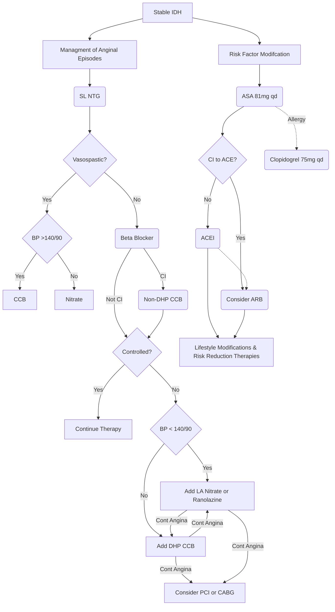

```mermaid
graph TD;
	sidh[Stable IDH] --> start;
	sidh --> rfm;
	
	
	start[Managment of Anginal Episodes] --> ntg(SL NTG)
	ntg --> vasoAngina{Vasospastic?}
	vasoAngina --> |No| bb(Beta Blocker)
	vasoAngina --> |Yes| currentBp{BP >140/90}
	currentBp --> |Yes| ccb[CCB]
	currentBp --> |No| nitrate[Nitrate]
	bb --> |Not CI| controlled{Controlled?}
	bb --> |CI| nonDHP(Non-DHP CCB)
	nonDHP --> controlled
	controlled --> |Yes| continue[Continue Therapy]
	controlled --> |No| bp2{BP < 140/90}
	bp2 --> |Yes| laNitrate[Add LA Nitrate or Ranolazine]
	bp2 --> |No| dhpCCB[Add DHP CCB]
	dhpCCB --> |Cont Angina| laNitrate
	laNitrate --> |Cont Angina| dhpCCB
	dhpCCB --> |Cont Angina| pci[Consider PCI or CABG]
	laNitrate --> |Cont Angina| pci[Consider PCI or CABG]
	

	rfm[Risk Factor Modifcation] --> asa(ASA 81mg qd);
	asa --> acearb{CI to ACE?}
	asa -.->|Allergy| clopid(Clopidogrel 75mg qd);
	acearb --> |No| acei(ACEI)
	acearb --> |Yes| arb(Consider ARB)
	acei -.-> arb
	acei --> life[Lifestyle Modifications & Risk Reduction Therapies];
	arb --> life;
	
```

